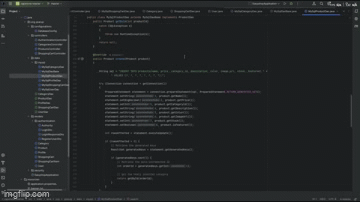
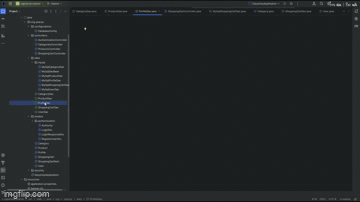
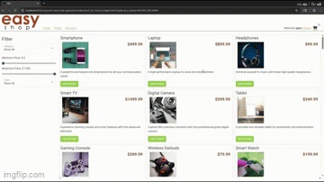

# Project Title

## Description of the Project

EZ-Shop is a Java-based RESTful web application designed to support a simple e-commerce platform. It enables users to browse products, manage categories, and perform CRUD operations securely. The project serves as a learning tool for understanding Java Spring Boot APIs, security with role-based access, and integration with front-end clients or tools like Postman. Intended users include developers exploring RESTful API design and small businesses interested in basic inventory and catalog management systems.

## User Stories

- As a shopper, I want to browse products by category so that I can easily find items I'm interested in.

- As an admin, I want to add, update, and delete products and categories so that I can keep the catalog up to date.

- As a user, I want to register and log in so that I can access personalized features.

- As a developer, I want clear API endpoints so that I can integrate this backend with a front-end application.

- As an admin, I want secure role-based access so that unauthorized users can’t modify data.

## Setup

### Prerequisites

- IntelliJ IDEA: Ensure you have IntelliJ IDEA installed, which you can download from [here](https://www.jetbrains.com/idea/download/).
- Java SDK: Make sure Java SDK is installed and configured in IntelliJ.

### Running the Application in IntelliJ

Follow these steps to get your application running within IntelliJ IDEA:

1. Open IntelliJ IDEA.
2. Select "Open" and navigate to the directory where you cloned or downloaded the project.
3. After the project opens, wait for IntelliJ to index the files and set up the project.
4. Find the main class with the `public static void main(String[] args)` method.
5. Right-click on the file and select 'Run `EzShopApplication.main()` to start the application.
6. The API will be available by default at `http://localhost:8080`

## Technologies Used

- Java 17
- Spring Boot 
- Spring Security
- Postman (for testing endpoints)

## Demo

## Future Work

- Add JWT authentication for token-based security.

- Implement order processing and checkout flow.

- Add pagination and filtering to product listings.

- Create a front-end interface (React or Angular) to interact with the API.

## Resources

List resources such as tutorials, articles, or documentation that helped you during the project.

- [Java Programming Tutorial](https://www.learnjavaonline.org)
- [Spring Boot Reference Guide](spring.io/projects/spring-boot/)
- [Spring Security Tutorial](https://www.baeldung.com/security-spring)

## Team Members

- **Joseph Villafane Valencia** - Developer, API Design, Tester
- **Raymond Maroun** - Instructor and Mentor.

## Thanks

- Thank you to my instructors and peers for support and guidance throughout this project.

- Special thanks to the open-source community for resources and examples that helped shape this application.

- Thank you to [Raymond] for continuous support and guidance.

 